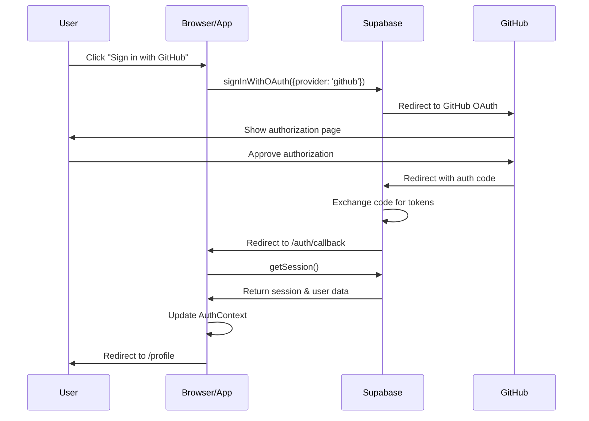

# 🏗️ Authentication Architecture

## Overview

This project implements a production-ready authentication system using Supabase Auth and GitHub OAuth, integrated into a Docusaurus static site.

## Architecture Diagram

```
┌─────────────────────────────────────────────────────────────┐
│                      User Browser                            │
│  ┌──────────────────────────────────────────────────────┐   │
│  │         Docusaurus App (React)                       │   │
│  │  ┌────────────────────────────────────────────────┐  │   │
│  │  │  AuthProvider (React Context)                  │  │   │
│  │  │  - Manages global auth state                   │  │   │
│  │  │  - Provides auth methods                       │  │   │
│  │  │  - Listens to auth changes                     │  │   │
│  │  └────────────────────────────────────────────────┘  │   │
│  │                                                        │   │
│  │  Components consuming auth:                           │   │
│  │  ┌─────────────┐  ┌──────────┐  ┌──────────────┐     │   │
│  │  │ AuthButton  │  │ Profile  │  │  Other Pages │     │   │
│  │  │ (Navbar)    │  │   Page   │  │  (Protected) │     │   │
│  │  └─────────────┘  └──────────┘  └──────────────┘     │   │
│  └────────────────────────────────────────────────────────┘  │
└───────────────────────┬─────────────────────────────────────┘
                        │
                        │ API Calls
                        ▼
┌─────────────────────────────────────────────────────────────┐
│                   Supabase Backend                           │
│  ┌───────────────────────────────────────────────────────┐  │
│  │  Supabase Auth Service                                │  │
│  │  - Manages sessions & tokens                         │  │
│  │  - OAuth flow coordination                           │  │
│  │  - Token refresh                                     │  │
│  └───────────────────────────────────────────────────────┘  │
└───────────────────────┬─────────────────────────────────────┘
                        │
                        │ OAuth Flow
                        ▼
┌─────────────────────────────────────────────────────────────┐
│                    GitHub OAuth                              │
│  - User authorization                                        │
│  - Profile data                                              │
│  - Access tokens                                             │
└─────────────────────────────────────────────────────────────┘
```

## Component Hierarchy

```
Root (AuthProvider wrapper)
│
├── Navbar
│   └── NavbarContent
│       └── AuthButton
│           ├── Sign In Button (when logged out)
│           └── User Menu (when logged in)
│               ├── Avatar
│               ├── Username
│               └── Sign Out Button
│
└── Routes
    ├── Home (/)
    ├── Profile (/profile)
    │   ├── Protected by auth check
    │   └── Displays user data
    └── Auth Callback (/auth/callback)
        └── Handles OAuth redirect
```

## Authentication Flow

### Sign In Flow



### Session Persistence

1. **Session Storage**: Sessions are stored in `localStorage` by default
2. **Auto Refresh**: Tokens are automatically refreshed before expiration
3. **State Sync**: Auth state changes trigger React context updates
4. **Event Listeners**: `onAuthStateChange` keeps UI in sync

## File Structure and Responsibilities

### Core Files

#### `src/lib/supabase.ts`
**Purpose**: Supabase client initialization
```typescript
- Creates singleton Supabase client
- Configures auth options:
  - autoRefreshToken: true
  - persistSession: true
  - detectSessionInUrl: true
```

#### `src/contexts/AuthContext.tsx`
**Purpose**: Global authentication state management
```typescript
Provides:
- user: Current user object or null
- session: Current session or null
- loading: Loading state
- signInWithGitHub(): Initiates OAuth flow
- signOut(): Signs out user
```

#### `src/theme/Root.tsx`
**Purpose**: App-wide provider wrapper
```typescript
- Wraps entire Docusaurus app
- Makes auth context available globally
- Runs on every page
```

### UI Components

#### `src/components/Auth/AuthButton.tsx`
**Purpose**: Navbar authentication UI
```typescript
States:
- Loading: Shows "Loading..."
- Authenticated: Shows avatar + username + sign out
- Not Authenticated: Shows sign in button

Responsive:
- Desktop: Full user info
- Mobile: Condensed view
```

#### `src/pages/profile.tsx`
**Purpose**: User profile page
```typescript
Features:
- Protected route (redirects if not logged in)
- Displays GitHub data:
  - Avatar
  - Name
  - Username
  - Email
  - Bio
  - Account creation date
- Links to GitHub profile
```

#### `src/pages/auth/callback.tsx`
**Purpose**: OAuth redirect handler
```typescript
Process:
1. Receives OAuth callback
2. Checks for session
3. Redirects to /profile if success
4. Redirects to / if failure
```

### Theme Customization

#### `src/theme/Navbar/Content/index.tsx`
**Purpose**: Custom navbar with auth button
```typescript
- Swizzled Docusaurus component
- Adds AuthButton to navbar
- Maintains all original navbar functionality
```

## State Management

### AuthContext State Flow

```
Initial Load
    │
    ├─→ getSession()
    │       │
    │       ├─→ Session exists
    │       │       └─→ Set user & session
    │       │
    │       └─→ No session
    │               └─→ Set user = null
    │
    └─→ Subscribe to onAuthStateChange
            │
            └─→ Emit on every auth change:
                    - Sign in
                    - Sign out
                    - Token refresh
                    - Session update
```

### React State Updates

```typescript
// AuthContext state
const [user, setUser] = useState<User | null>(null);
const [session, setSession] = useState<Session | null>(null);
const [loading, setLoading] = useState(true);

// Updates trigger re-renders in all consuming components
```

## Security Considerations

### What's Safe to Expose

✅ **Supabase URL**: Public, designed to be in client code
✅ **Anon Key**: Public API key, safe in browsers
✅ **User Metadata**: Public GitHub profile data

### What's Protected

🔒 **Service Role Key**: Never use in client code
🔒 **GitHub Client Secret**: Only in Supabase settings
🔒 **Access Tokens**: Managed by Supabase, never exposed

### Row Level Security (RLS)

When adding database tables:

```sql
-- Enable RLS
alter table your_table enable row level security;

-- Example policy
create policy "Users can only read own data"
  on your_table for select
  using ( auth.uid() = user_id );
```

## Performance Considerations

### Initial Load
- Auth check happens on app mount
- Minimal delay (~100-200ms)
- Loading state prevents flash of incorrect UI

### Session Refresh
- Automatic background refresh
- No user interaction required
- Happens ~5 minutes before expiration

### Caching
- Session stored in localStorage
- No repeated auth checks on navigation
- Instant auth state on page refresh

## Extending the System

### Add More OAuth Providers

```typescript
// In AuthContext.tsx
const signInWithGoogle = async () => {
  await supabase.auth.signInWithOAuth({
    provider: 'google',
  });
};
```

### Add Protected Routes

```typescript
function useRequireAuth() {
  const { user, loading } = useAuth();
  const history = useHistory();

  useEffect(() => {
    if (!loading && !user) {
      history.push('/');
    }
  }, [user, loading, history]);

  return { user, loading };
}
```

### Add Role-Based Access

```typescript
function useHasRole(requiredRole: string) {
  const { user } = useAuth();
  return user?.user_metadata?.role === requiredRole;
}
```

### Add User Database

```typescript
// Create profile on signup
supabase.auth.onAuthStateChange((event, session) => {
  if (event === 'SIGNED_IN' && session) {
    // Create or update user profile
    supabase.from('profiles').upsert({
      id: session.user.id,
      username: session.user.user_metadata.user_name,
      avatar_url: session.user.user_metadata.avatar_url,
    });
  }
});
```

## Environment Variables

### Development
```env
REACT_APP_SUPABASE_URL=http://localhost:54321  # Local Supabase
REACT_APP_SUPABASE_ANON_KEY=your-local-key
```

### Production
```env
REACT_APP_SUPABASE_URL=https://xxx.supabase.co
REACT_APP_SUPABASE_ANON_KEY=your-prod-key
```

## Testing Strategy

### Unit Tests
```typescript
// Test AuthContext
describe('AuthContext', () => {
  it('provides auth state', () => {
    const { result } = renderHook(() => useAuth());
    expect(result.current.user).toBeDefined();
  });
});
```

### Integration Tests
```typescript
// Test sign in flow
it('signs in user', async () => {
  const { getByText } = render(<App />);
  fireEvent.click(getByText('Sign in with GitHub'));
  await waitFor(() => {
    expect(window.location.href).toContain('github.com');
  });
});
```

### E2E Tests
```typescript
// Playwright/Cypress
test('complete auth flow', async ({ page }) => {
  await page.goto('/');
  await page.click('text=Sign in with GitHub');
  // ... complete OAuth flow
  await expect(page).toHaveURL('/profile');
});
```

## Troubleshooting Guide

### Debug Auth State
```typescript
// Add to AuthContext
useEffect(() => {
  console.log('Auth State:', { user, session, loading });
}, [user, session, loading]);
```

### Check Supabase Connection
```typescript
const testConnection = async () => {
  const { data, error } = await supabase.auth.getSession();
  console.log('Connection test:', { data, error });
};
```

### Verify Environment Variables
```typescript
console.log('Supabase URL:', process.env.REACT_APP_SUPABASE_URL);
console.log('Has anon key:', !!process.env.REACT_APP_SUPABASE_ANON_KEY);
```

## Best Practices

1. ✅ Always check `loading` state before rendering auth-dependent UI
2. ✅ Use the `useAuth` hook instead of accessing Supabase directly
3. ✅ Handle auth errors gracefully with try/catch
4. ✅ Keep sensitive data in environment variables
5. ✅ Enable RLS on all database tables
6. ✅ Test auth flow in incognito/private mode
7. ✅ Clear localStorage when debugging auth issues

## Migration Guide

### From Another Auth System

1. **Export Users**: Get user data from current system
2. **Import to Supabase**: Use Supabase admin API
3. **Update Components**: Replace auth hooks
4. **Test Thoroughly**: Verify all auth flows
5. **Deploy**: Use feature flags for gradual rollout

## Resources

- [Supabase Auth Docs](https://supabase.com/docs/guides/auth)
- [GitHub OAuth Docs](https://docs.github.com/en/developers/apps/building-oauth-apps)
- [Docusaurus Swizzling](https://docusaurus.io/docs/swizzling)
- [React Context Best Practices](https://react.dev/learn/passing-data-deeply-with-context)

---

**Built with ❤️ using Supabase, React, and Docusaurus**
