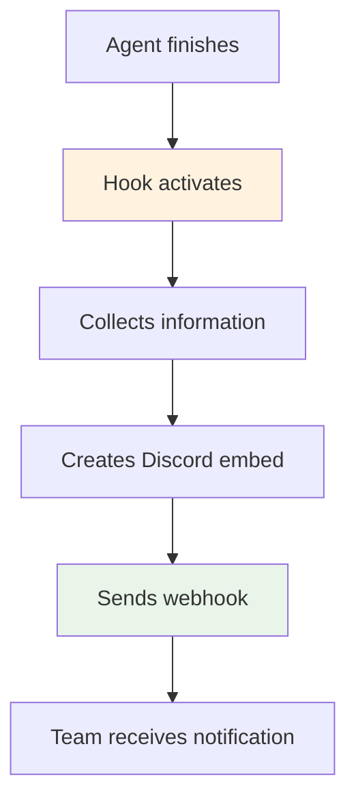

# Discord Notifications Hook

> Hook that sends automatic Discord notifications when the agent updates documentation.

## What does this hook do?

The **Discord Notifications Hook** runs automatically after the Docusaurus Expert agent updates documentation, sending a rich notification to your Discord channel with:

- **PR title** created automatically
- **List of files** that changed
- **Direct link** to review changes
- **Visual format** with Discord embeds

## Hook flow



## Quick setup

### 1. Create webhook in Discord

1. **Open Discord** → Go to your server
2. **Channel Settings** → **Integrations** → **Webhooks**
3. **Create Webhook** → **Copy Webhook URL**

### 2. Add URL to repository

GitHub → **Settings** → **Secrets and variables** → **Actions**
- **Name**: `DISCORD_WEBHOOK_URL`
- **Secret**: Your webhook URL

### 3. Workflow already includes the hook

The hook code is already in the GitHub Actions workflow:

```python title="Hook included in workflow"
#!/usr/bin/env python3
import os, requests, json
from datetime import datetime

webhook = os.getenv('DISCORD_WEBHOOK_URL')
if not webhook: exit(0)

embed = {
    "title": "📚 Documentation updated",
    "description": "The agent created a documentation PR",
    "color": 0x5865F2,
    "timestamp": datetime.utcnow().isoformat(),
    "fields": [{
        "name": "Files changed",
        "value": f"```\n{os.getenv('CHANGED_FILES', '')}\n```"
    }]
}

requests.post(webhook, json={"embeds": [embed]}, timeout=30)
```

## Message customization

### Basic message
```python
# Simple notification
payload = {
    "content": "📚 Documentation updated automatically!"
}
```

### Complete custom embed
```python
embed = {
    "title": "🤖 Docusaurus Expert Agent",
    "description": "New documentation changes",
    "color": 0x00ff00,  # Green
    "fields": [
        {
            "name": "🔗 Pull Request",
            "value": "[View changes](PR_URL)"
        },
        {
            "name": "📂 Files",
            "value": "src/api.js\nsrc/utils.js"
        },
        {
            "name": "👥 Action required",
            "value": "Review and approve changes"
        }
    ],
    "footer": {"text": "Claude Code Documentation Studio"}
}
```

### Team mentions
```python
# Mention specific role
payload = {
    "content": "<@&ROLE_ID> New documentation ready for review!",
    "embeds": [embed]
}
```

## Manual hook (optional)

If you want to create the hook separately:

```python title=".claude/hooks/discord-notify.py"
#!/usr/bin/env python3
"""Hook for Discord notifications"""

import os
import requests
import json
import sys
from datetime import datetime

def send_notification():
    webhook_url = os.getenv('DISCORD_WEBHOOK_URL')
    if not webhook_url:
        print("No webhook configured")
        return

    # PR information
    pr_title = os.getenv('PR_TITLE', 'Documentation updated')
    pr_url = os.getenv('PR_URL', '#')
    changed_files = os.getenv('CHANGED_FILES', 'Not specified')

    # Create embed
    embed = {
        "title": "📚 Documentation Updated",
        "description": f"Docusaurus Expert agent created a new PR",
        "url": pr_url,
        "color": 0x5865F2,
        "timestamp": datetime.utcnow().isoformat(),
        "fields": [
            {
                "name": "📝 Pull Request",
                "value": f"[{pr_title}]({pr_url})",
                "inline": False
            },
            {
                "name": "📄 Modified files",
                "value": f"```\n{changed_files}\n```",
                "inline": False
            },
            {
                "name": "🔍 Next step",
                "value": "Review and approve documentation changes",
                "inline": False
            }
        ],
        "footer": {
            "text": "Claude Code Documentation Studio",
            "icon_url": "https://github.com/anthropics.png"
        }
    }

    # Send to Discord
    payload = {
        "embeds": [embed],
        "username": "Documentation Bot",
        "avatar_url": "https://github.com/anthropics.png"
    }

    try:
        response = requests.post(webhook_url, json=payload, timeout=30)
        response.raise_for_status()
        print("✅ Discord notification sent")
    except Exception as e:
        print(f"❌ Error sending notification: {e}")

if __name__ == "__main__":
    send_notification()
```

## Testing

### Test webhook manually
```bash
# Test webhook works
curl -X POST "YOUR_WEBHOOK_URL" \
  -H "Content-Type: application/json" \
  -d '{"content": "🧪 Webhook test"}'
```

### Test with environment variables
```bash
# Simulate hook execution
export DISCORD_WEBHOOK_URL="your-webhook-url"
export CHANGED_FILES="src/api.js src/utils.js"
export PR_TITLE="Docs updated"

python3 .claude/hooks/discord-notify.py
```

### Trigger in real workflow
1. Make changes to JavaScript/TypeScript code
2. Create PR to main
3. Workflow will run automatically
4. Check your Discord channel for notification

## Advanced configuration

### Different channels by change type
```python
def get_webhook_by_files(files):
    if any('api/' in f for f in files):
        return os.getenv('DISCORD_API_WEBHOOK')
    elif any('docs/' in f for f in files):
        return os.getenv('DISCORD_DOCS_WEBHOOK')
    else:
        return os.getenv('DISCORD_GENERAL_WEBHOOK')
```

### Notification schedules
```python
from datetime import datetime

def should_notify():
    hour = datetime.now().hour
    # Only notify during work hours (9-18)
    return 9 <= hour <= 18
```

### Rate limiting
```python
import time
from datetime import datetime, timedelta

def can_send_notification():
    last_sent_file = '/tmp/last_discord_notification'

    if os.path.exists(last_sent_file):
        with open(last_sent_file, 'r') as f:
            last_sent = datetime.fromisoformat(f.read().strip())

        # Don't send more than one notification every 5 minutes
        if datetime.now() - last_sent < timedelta(minutes=5):
            return False

    # Save current timestamp
    with open(last_sent_file, 'w') as f:
        f.write(datetime.now().isoformat())

    return True
```

## Troubleshooting

### No notifications received
1. **Verify webhook URL** in GitHub Secrets
2. **Check permissions** in Discord
3. **Review logs** in GitHub Actions workflow

### Format error
```bash
# Verify JSON is valid
echo '{"content": "test"}' | python3 -m json.tool
```

### Discord rate limiting
```bash
# Discord limits webhooks to 30 messages per minute
# Implement delays if sending many notifications
```

## Next step

With notifications configured:

1. **Test** the complete workflow
2. **Adjust** message format for your needs
3. **Set up** [Complete Testing](/docs/setup/testing) of the system

---

*Ready! Your team will receive automatic notifications every time documentation is updated.*