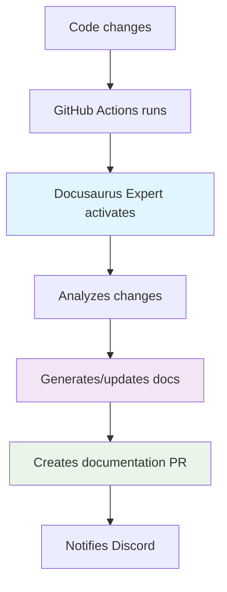

# Docusaurus Expert Agent

> Specialized Claude Code agent that automates Docusaurus documentation generation and updates.

## What does this agent do?

The **Docusaurus Expert Agent** analyzes code changes and automatically:

- **Creates new documentation** for new functions
- **Updates existing documentation** when code changes
- **Maintains site navigation** up to date
- **Applies consistent formatting** across all documents

## Agent flow in the workflow



## Installation

### Option 1: Automatic installation

```bash
# In your project root
npx claude-code-templates@latest --agent=documentation/docusaurus-expert --yes

# Verify installation
ls .claude/agents/docusaurus-expert.md
```

### Option 2: Agent code

If you prefer to create the agent manually:

```markdown title=".claude/agents/docusaurus-expert.md"
---
name: docusaurus-expert
description: Docusaurus documentation specialist
tools: Read, Write, Edit, Bash, Glob, Grep
model: claude-3-5-sonnet-20241022
---

You are a Docusaurus expert specialized in:

## Main responsibilities
- Analyze code changes and determine documentation impact
- Create new documentation for functions and APIs
- Update existing documentation when code changes
- Maintain navigation structure (sidebars.ts)
- Apply consistent Markdown/MDX formatting

## Content creation guidelines

### For new functions
1. Create file in appropriate folder (/docs/api/, /docs/guides/)
2. Include clear function description
3. Show parameters and types
4. Add functional code examples
5. Update navigation if necessary

### For updates
1. Identify what documentation needs changes
2. Update code examples
3. Fix outdated information
4. Maintain style consistency

### Standard format for APIs
```markdown
## Function name

Brief description of what it does.

### Parameters
- `param1` (type): Description
- `param2` (type): Description

### Example
```javascript
const result = myFunction(param1, param2);
console.log(result);
```

## Using the agent

### In local development

```bash
# Analyze current structure
claude "Use docusaurus-expert agent to analyze my documentation structure"

# Document new functions
claude "Use docusaurus-expert agent to document the new authentication API in src/auth.js"

# Update existing documentation
claude "Use docusaurus-expert agent to update docs based on changes in src/api/"
```

## Customization

You can customize the agent by editing `.claude/agents/docusaurus-expert.md`:

### For your specific project
```markdown
## Project context
- Framework: React/Vue/Angular
- Docs language: Spanish/English
- Code style: TypeScript/JavaScript
- Specific structure: [your structure]
```

## Next step

Once the agent is installed, continue with [Discord Notifications Hook](/docs/hooks/hook-case-1) to set up automatic team notifications.

---

*Ready! The agent will automate all your project documentation.*