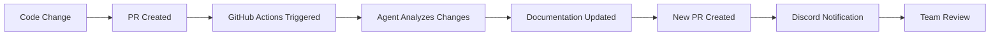

# Complete CI/CD Workflow

> End-to-end automation pipeline combining Claude Code agents, Discord notifications, and GitHub Actions for intelligent documentation workflows.

## Overview

This workflow creates a complete automation pipeline that:

1. **Detects code changes** in pull requests
2. **Executes the Docusaurus Expert agent** to update documentation
3. **Creates documentation PRs** automatically
4. **Sends Discord notifications** to keep teams informed
5. **Provides detailed reporting** and monitoring

## Architecture Flow



## Complete Workflow Implementation

### Step 1: Create the GitHub Actions Workflow

Create the main workflow file at `.github/workflows/docusaurus-auto-docs.yml`:

```yaml title=".github/workflows/docusaurus-auto-docs.yml"
# Docusaurus Documentation Automation
# Automated documentation update workflow using Claude Code Docusaurus Expert agent
# Triggers on pull requests and creates documentation updates via Discord notifications

name: Docusaurus Documentation Automation

on:
  pull_request:
    branches:
      - main
    paths:
      # CUSTOMIZE: Add file types that should trigger documentation updates
      - '**.js'
      - '**.ts'
      - '**.jsx'
      - '**.tsx'
      - '**.py'
      - '**.java'
      - '**.md'

      # CUSTOMIZE: Exclude paths that shouldn't trigger documentation
      - '!.github/**'
      - '!**/node_modules/**'
      - '!**/dist/**'
      - '!**/build/**'
      - '!docs/**'  # CRITICAL: Replace 'docs' with your Docusaurus folder path

jobs:
  auto-document:
    runs-on: ubuntu-latest
    permissions:
      contents: write
      pull-requests: write
      id-token: write  # Required for claude-code-action

    steps:
      # Step 1: Checkout repository with full history
      - name: Checkout repository
        uses: actions/checkout@v4
        with:
          fetch-depth: 0  # Full history needed for proper diff analysis

      # Step 2: Setup Claude configuration and install Docusaurus Expert agent
      - name: Setup Claude configuration
        run: |
          mkdir -p .claude/agents
          mkdir -p .claude/hooks

          # Install Docusaurus Expert agent if not exists
          if [ ! -f ".claude/agents/docusaurus-expert.md" ]; then
            echo "Installing Docusaurus Expert agent..."
            npx claude-code-templates@latest \
              --agent documentation/docusaurus-expert \
              --yes \
              --directory .
          else
            echo "Docusaurus Expert agent already exists"
          fi

      # Step 3: Install Discord notification hook
      - name: Create Discord notification hook
        run: |
          cat > .claude/hooks/discord-pr-notification.py << 'EOF'
          #!/usr/bin/env python3
          """Discord PR Notification Hook"""

          import json
          import sys
          import os
          import requests
          from datetime import datetime

          def send_discord_notification(webhook_url, pr_data):
              embed = {
                  "title": "📚 Documentation Updated",
                  "description": "The Docusaurus Expert agent has created a new documentation PR",
                  "color": 0x5865F2,
                  "timestamp": datetime.utcnow().isoformat(),
                  "fields": [
                      {
                          "name": "📝 Pull Request",
                          "value": f"[{pr_data['title']}]({pr_data['url']})",
                          "inline": False
                      },
                      {
                          "name": "📄 Files Changed",
                          "value": f"```\n{pr_data['files']}\n```" if pr_data['files'] else "No files listed",
                          "inline": False
                      }
                  ]
              }

              payload = {
                  "embeds": [embed],
                  "username": "Documentation Bot"
              }

              try:
                  response = requests.post(webhook_url, json=payload, timeout=30)
                  response.raise_for_status()
                  return True
              except requests.RequestException as e:
                  print(f"Failed to send Discord notification: {e}", file=sys.stderr)
                  return False

          def main():
              webhook_url = os.getenv('DISCORD_WEBHOOK_URL')
              if not webhook_url:
                  print("No Discord webhook URL configured", file=sys.stderr)
                  sys.exit(0)

              pr_data = {
                  'title': 'Documentation Update',
                  'url': f"https://github.com/{os.getenv('GITHUB_REPOSITORY', 'unknown/repo')}",
                  'files': os.getenv('CHANGED_FILES', '').replace(' ', '\n')
              }

              success = send_discord_notification(webhook_url, pr_data)
              if success:
                  print("✅ Discord notification sent successfully")
              else:
                  print("❌ Failed to send Discord notification")

          if __name__ == "__main__":
              main()
          EOF

          chmod +x .claude/hooks/discord-pr-notification.py

      # Step 4: Get changed files for context
      - name: Get changed files
        id: changed
        run: |
          # Fetch the base branch for comparison
          git fetch origin main:main

          # Get list of changed files
          CHANGED_FILES=$(git diff --name-only main...HEAD | head -20 | tr '\n' ' ')
          echo "files=$CHANGED_FILES" >> $GITHUB_OUTPUT

          CHANGED_FILES_MULTILINE=$(git diff --name-only main...HEAD | head -20)
          echo "files_multiline<<EOF" >> $GITHUB_OUTPUT
          echo "$CHANGED_FILES_MULTILINE" >> $GITHUB_OUTPUT
          echo "EOF" >> $GITHUB_OUTPUT

      # Step 5: Update documentation using Docusaurus Expert agent
      - name: Update documentation
        uses: anthropics/claude-code-action@v1
        with:
          anthropic_api_key: ANTHROPIC_API_KEY_SECRET
          prompt: |
            Read and follow the instructions in .claude/agents/docusaurus-expert.md

            Changed files in this pull request:
            CHANGED_FILES_LIST

            ## Requirements
            1. Find the Docusaurus documentation (check: docs/, docu/, documentation/, website/docs/)
            2. Update documentation for any changed functionality
            3. Add new documentation for new features
            4. Update API references if function signatures changed
            5. Ensure all code examples match the current implementation
            6. Maintain consistent documentation style and formatting

            ## Project-specific rules
            - Documentation language: English
            - Code examples should include TypeScript types where applicable
            - Follow existing documentation structure and style
            - Update getting-started.md for new features
            - Create feature-specific documentation files when appropriate

            Focus on documenting the changes found in the modified files above.
          claude_args: "--max-turns 15 --dangerously-skip-permissions"

      # Step 6: Create pull request with documentation updates
      - name: Create Pull Request
        id: create-pr
        uses: peter-evans/create-pull-request@v6
        with:
          token: GITHUB_TOKEN_SECRET
          commit-message: "docs: update documentation via docusaurus-expert agent"
          title: "📚 Documentation Update - Automated"
          body: |
            ## Automated Documentation Update

            This pull request contains documentation updates generated by the Docusaurus Expert agent.

            ### Review Checklist:
            - [ ] Documentation accuracy verified
            - [ ] Code examples tested
            - [ ] Links and references working
            - [ ] Style consistency maintained

            **Generated by:** Claude Code Docusaurus Expert Agent
          branch: docs/auto-update
          base: main

      # Step 7: Send Discord notification
      - name: Send Discord notification
        if: steps.create-pr.outputs.pull-request-number != ''
        run: |
          export CHANGED_FILES="CHANGED_FILES_VALUE"
          export DISCORD_WEBHOOK_URL="DISCORD_WEBHOOK_SECRET"

          echo "🔔 Sending Discord notification"
          python3 .claude/hooks/discord-pr-notification.py
        env:
          GITHUB_REPOSITORY: GITHUB_REPO_VALUE

      # Step 8: Workflow summary
      - name: Workflow Summary
        if: always()
        run: |
          echo "## 📋 Workflow Summary" >> $GITHUB_STEP_SUMMARY
          echo "- **Documentation PR Created:** PR_NUMBER" >> $GITHUB_STEP_SUMMARY
          echo "- **Discord Notification:** DISCORD_STATUS" >> $GITHUB_STEP_SUMMARY
```

:::note Variable Placeholders
The workflow above uses placeholder values like `ANTHROPIC_API_KEY_SECRET` that need to be replaced with actual GitHub Actions expressions when implementing. See the configuration section below for proper setup.
:::

## Configuration Requirements

### GitHub Repository Secrets

Add these secrets to your repository (Settings → Secrets and variables → Actions):

| Secret Name | Description | Example |
|-------------|-------------|---------|
| `ANTHROPIC_API_KEY` | Your Anthropic API key for Claude Code | `sk-ant-api03-...` |
| `DISCORD_WEBHOOK_URL` | Discord webhook URL for notifications | `https://discord.com/api/webhooks/...` |

### Repository Permissions

Configure these permissions in Settings → Actions → General → Workflow permissions:

- ✅ **Read repository contents and packages permissions**
- ✅ **Allow GitHub Actions to create and approve pull requests**

### Branch Protection (Optional)

For additional security, configure branch protection rules:

- **Require pull request reviews** before merging documentation updates
- **Require status checks** to pass before merging
- **Restrict pushes** to main branch

## Workflow Steps Explained

### 1. **Trigger Configuration**
- Monitors pull requests to `main` branch
- Includes specific file types (JS, TS, Python, etc.)
- Excludes documentation folders to prevent infinite loops

### 2. **Environment Setup**
- Checks out repository with full Git history
- Creates necessary directories for Claude Code
- Installs the Docusaurus Expert agent

### 3. **Hook Installation**
- Creates Discord notification hook script
- Sets proper permissions for execution
- Configures webhook integration

### 4. **Change Detection**
- Analyzes differences between branches
- Identifies modified files for documentation updates
- Prepares context for the agent

### 5. **Agent Execution**
- Runs Docusaurus Expert agent with specific instructions
- Analyzes code changes and updates documentation
- Follows project-specific style guidelines

### 6. **PR Creation**
- Creates new pull request with documentation changes
- Includes descriptive commit messages and PR body
- Sets up proper branch naming and targeting

### 7. **Notification System**
- Sends Discord notifications about documentation updates
- Includes rich embed with PR details and changed files
- Provides direct links for team review

### 8. **Reporting**
- Generates workflow summary for GitHub Actions
- Provides execution status and next steps
- Logs important information for debugging

## Advanced Customization

### Multi-Language Support

For projects with multiple language documentation:

```yaml
# Add language detection step
- name: Detect documentation languages
  id: langs
  run: |
    LANGS=$(find docs/ -type d -name "??-*" | cut -d'/' -f2 | sort -u)
    echo "languages=$LANGS" >> $GITHUB_OUTPUT

# Update agent prompt for each language
- name: Update documentation per language
  run: |
    for lang in ${{ steps.langs.outputs.languages }}; do
      echo "Updating $lang documentation..."
      # Run agent for specific language
    done
```

### Conditional Agent Execution

Run different agents based on changed file types:

```yaml
- name: Determine agent strategy
  id: strategy
  run: |
    if echo "${{ steps.changed.outputs.files }}" | grep -q "\.py$"; then
      echo "agent=python-expert" >> $GITHUB_OUTPUT
    elif echo "${{ steps.changed.outputs.files }}" | grep -q "\.(js|ts)$"; then
      echo "agent=docusaurus-expert" >> $GITHUB_OUTPUT
    else
      echo "agent=general-purpose" >> $GITHUB_OUTPUT
    fi
```

### Enhanced Error Handling

Add retry logic and better error reporting:

```yaml
- name: Update documentation with retry
  uses: nick-invision/retry@v2
  with:
    timeout_minutes: 10
    max_attempts: 3
    retry_on: error
    command: |
      # Agent execution with retry logic
```

### Performance Optimization

Cache dependencies and optimize execution:

```yaml
- name: Cache Claude dependencies
  uses: actions/cache@v3
  with:
    path: ~/.claude
    key: claude-cache-${{ runner.os }}-${{ hashFiles('package-lock.json') }}
    restore-keys: |
      claude-cache-${{ runner.os }}-
```

## Monitoring and Analytics

### Workflow Metrics

Track important metrics for your documentation automation:

- **Execution Time**: Monitor how long documentation updates take
- **Success Rate**: Track percentage of successful automated updates
- **Agent Accuracy**: Measure quality of generated documentation
- **Team Adoption**: Monitor PR review and merge rates

### Debug Workflows

For troubleshooting workflow issues:

```yaml
- name: Debug Information
  if: failure()
  run: |
    echo "Repository: $GITHUB_REPOSITORY"
    echo "Event: $GITHUB_EVENT_NAME"
    echo "Changed files: ${{ steps.changed.outputs.files }}"
    echo "Agent logs:"
    cat ~/.claude/logs/* || echo "No logs found"
```

### Monitoring Dashboard

Set up monitoring for your automation:

1. **GitHub Actions Insights**: Monitor workflow execution patterns
2. **Discord Webhook Analytics**: Track notification delivery rates
3. **Documentation Quality Metrics**: Measure accuracy and completeness

## Security Considerations

### API Key Management

- **Never commit API keys** to your repository
- **Use GitHub Secrets** for all sensitive information
- **Rotate keys regularly** and monitor usage
- **Limit API key permissions** to minimum required scope

### Webhook Security

- **Validate webhook URLs** before adding to secrets
- **Monitor Discord audit logs** for webhook usage
- **Use dedicated service accounts** for automation
- **Implement rate limiting** in notification hooks

### Access Controls

- **Limit repository access** to necessary team members
- **Review workflow permissions** regularly
- **Use branch protection rules** to prevent unauthorized changes
- **Monitor workflow execution logs** for suspicious activity

## Troubleshooting Guide

### Common Issues and Solutions

**Workflow not triggering**
```bash
# Check file paths in trigger configuration
# Verify changed files match the patterns in workflow
git diff --name-only main...feature-branch
```

**Agent execution failures**
```bash
# Verify API key is correctly set
# Check agent installation and configuration
# Review Claude Code logs for detailed error messages
```

**Discord notifications not sent**
```bash
# Test webhook URL manually:
curl -X POST "YOUR_WEBHOOK_URL" \
  -H "Content-Type: application/json" \
  -d '{"content": "Test message"}'
```

**Documentation PR not created**
```bash
# Check GitHub token permissions
# Verify repository write permissions
# Review branch protection rules
```

### Performance Issues

**Slow workflow execution**
- Cache dependencies where possible
- Optimize file change detection
- Reduce agent context size
- Use parallel processing for multiple languages

**High API usage**
- Implement request caching
- Optimize agent prompts
- Use conditional execution
- Monitor API usage limits

## Best Practices

### Workflow Optimization

1. **Keep prompts focused** - Provide specific, actionable instructions to agents
2. **Use meaningful commit messages** - Help agents understand the context of changes
3. **Maintain consistent documentation structure** - Easier for agents to follow patterns
4. **Test workflows regularly** - Ensure automation continues working as expected

### Team Collaboration

1. **Establish review processes** - Don't auto-merge agent-generated documentation
2. **Train team on workflow** - Ensure everyone understands the automation
3. **Monitor and iterate** - Continuously improve based on team feedback
4. **Document the automation** - Keep this documentation up-to-date

### Quality Assurance

1. **Review agent outputs** - Always validate generated documentation
2. **Test code examples** - Ensure examples work as documented
3. **Maintain style consistency** - Regular audits of documentation quality
4. **Gather team feedback** - Identify areas for improvement

## Next Steps

Now that you have a complete CI/CD workflow:

1. **Deploy the workflow** to your repository
2. **Test with real code changes** to verify functionality
3. **Train your team** on the new automation process
4. **Monitor and optimize** based on usage patterns
5. **Expand automation** to other documentation types

Continue with [Discord Setup](/docs/setup/discord-setup) to configure team notifications, or jump to [Testing Guide](/docs/setup/testing) to verify your complete setup.

---

*Ready for production? This complete CI/CD workflow transforms how your team handles documentation! 🚀*