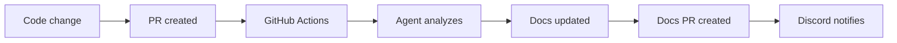

# GitHub Actions Workflow

> Complete workflow that runs the Docusaurus Expert agent and sends Discord notifications automatically.

## What does this workflow do?

1. **Triggers** when you create a PR with code changes
2. **Installs** the Docusaurus Expert agent automatically
3. **Analyzes changes** and updates documentation
4. **Creates a PR** with documentation updates
5. **Notifies Discord** team about changes

## Workflow architecture



## Workflow installation

### 1. Create workflow file

Create `.github/workflows/docusaurus-auto-docs.yml`:

```yaml title=".github/workflows/docusaurus-auto-docs.yml"
name: Automatic Documentation

on:
  pull_request:
    branches: [main]
    paths:
      - '**.js'
      - '**.ts'
      - '**.py'
      - '!docs/**'  # IMPORTANT: Prevents infinite loops

jobs:
  auto-docs:
    runs-on: ubuntu-latest
    permissions:
      contents: write
      pull-requests: write

    steps:
      - uses: actions/checkout@v4
        with:
          fetch-depth: 0

      - name: Install agent
        run: |
          mkdir -p .claude/agents .claude/hooks
          if [ ! -f ".claude/agents/docusaurus-expert.md" ]; then
            npx claude-code-templates@latest \
              --agent documentation/docusaurus-expert --yes
          fi

      - name: Create Discord hook
        run: |
          cat > .claude/hooks/discord-notify.py << 'EOF'
          #!/usr/bin/env python3
          import os, requests, json
          from datetime import datetime

          webhook = os.getenv('DISCORD_WEBHOOK_URL')
          if not webhook: exit(0)

          embed = {
              "title": "📚 Documentation updated",
              "description": "The agent created a documentation PR",
              "color": 0x5865F2,
              "timestamp": datetime.utcnow().isoformat(),
              "fields": [{
                  "name": "Files changed",
                  "value": f"```\n{os.getenv('CHANGED_FILES', '')}\n```"
              }]
          }

          requests.post(webhook, json={"embeds": [embed]}, timeout=30)
          print("✅ Notification sent")
          EOF

          chmod +x .claude/hooks/discord-notify.py

      - name: Detect changes
        id: changes
        run: |
          FILES=$(git diff --name-only HEAD~1 | tr '\n' ' ')
          echo "files=$FILES" >> $GITHUB_OUTPUT

      - name: Run agent
        uses: anthropics/claude-code-action@v1
        with:
          anthropic_api_key: ${{ secrets.ANTHROPIC_API_KEY }}
          prompt: |
            Use the docusaurus-expert agent to update documentation.

            Changed files: ${{ steps.changes.outputs.files }}

            Instructions:
            1. Analyze changes in these files
            2. Create/update relevant documentation
            3. Maintain consistent style
            4. Include code examples

      - name: Create PR
        uses: peter-evans/create-pull-request@v6
        with:
          token: ${{ secrets.GITHUB_TOKEN }}
          title: "📚 Docs updated automatically"
          body: |
            Documentation updated by Docusaurus Expert agent.

            Changes based on: ${{ steps.changes.outputs.files }}
          branch: docs/auto-update
          commit-message: "docs: automatic update"

      - name: Notify Discord
        run: |
          export DISCORD_WEBHOOK_URL="${{ secrets.DISCORD_WEBHOOK_URL }}"
          export CHANGED_FILES="${{ steps.changes.outputs.files }}"
          python3 .claude/hooks/discord-notify.py
```

### 2. Configure GitHub secrets

Go to **Settings → Secrets and variables → Actions** and add:

| Secret | Value |
|---------|-------|
| `ANTHROPIC_API_KEY` | Your Anthropic API key |
| `DISCORD_WEBHOOK_URL` | Discord webhook URL |

### 3. Enable permissions

In **Settings → Actions → General → Workflow permissions**:

- ✅ Read repository contents and packages permissions
- ✅ Allow GitHub Actions to create and approve pull requests

## How it works

### Automatic trigger
```yaml
on:
  pull_request:
    branches: [main]
    paths:
      - '**.js'      # JavaScript files
      - '**.ts'      # TypeScript files
      - '**.py'      # Python files
      - '!docs/**'   # Exclude docs folder (prevents loops)
```

### Workflow steps

1. **Checkout**: Downloads complete code
2. **Install agent**: Installs docusaurus-expert if doesn't exist
3. **Discord hook**: Creates notification script
4. **Detect changes**: Lists modified files
5. **Run agent**: Claude analyzes and updates docs
6. **Create PR**: New PR with updated documentation
7. **Notify**: Sends message to Discord

## Customization

### For different languages
```yaml
paths:
  - '**.java'    # Java
  - '**.go'      # Go
  - '**.php'     # PHP
  - '**.rb'      # Ruby
```

### For multiple branches
```yaml
on:
  pull_request:
    branches: [main, develop, staging]
```

### Specific exclusions
```yaml
paths:
  - '!tests/**'      # Exclude tests
  - '!*.config.js'   # Exclude configs
  - '!package*.json' # Exclude packages
```

## Testing

### Activate workflow

1. Make changes to a `.js` or `.ts` file
2. Commit and push to a branch
3. Create PR to `main`
4. Workflow will run automatically

### Verify execution

1. Go to **Actions** in your repo
2. Look for "Automatic Documentation"
3. Review logs for each step
4. Verify docs PR was created
5. Check Discord notification

## Troubleshooting

### Workflow doesn't run
```bash
# Verify changed files match the paths
git diff --name-only HEAD~1
```

### API key error
```bash
# Verify secret is configured
# GitHub → Settings → Secrets → ANTHROPIC_API_KEY
```

### Discord doesn't notify
```bash
# Test webhook manually
curl -X POST "YOUR_WEBHOOK_URL" \
  -H "Content-Type: application/json" \
  -d '{"content": "Test"}'
```

## Next steps

With workflow configured:

1. **Test** with real code change
2. **Review** auto-generated PR
3. **Configure** [Discord Setup](/docs/setup/discord-setup) if not done
4. **Do** [Complete Testing](/docs/setup/testing) of system

---

*Workflow ready! Your documentation will update automatically with every code change.*