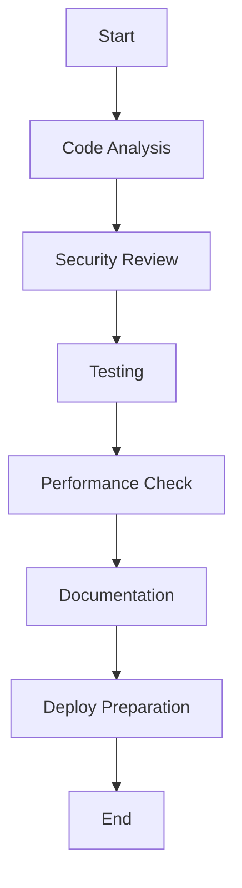
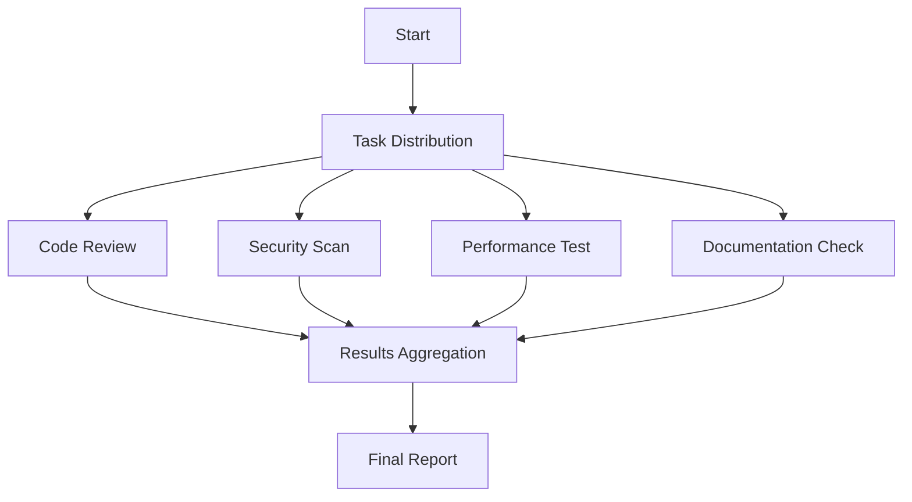
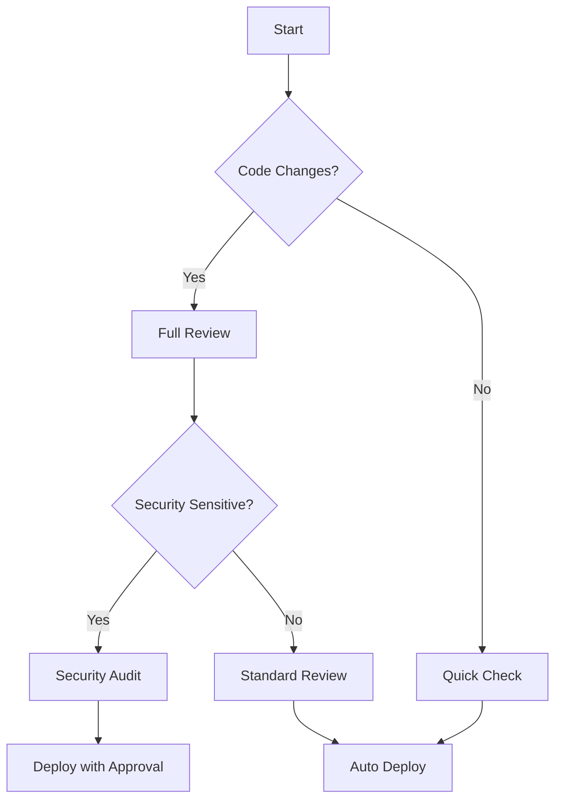

# Workflows Overview

Advanced Claude Code workflows orchestrate multiple subagents and hooks to automate complex development processes. This section covers sophisticated patterns for coordinating AI-assisted development at scale.

## What are Advanced Workflows?

Advanced workflows combine subagents, hooks, and external systems to create sophisticated automation that handles complete development processes from code creation to deployment.

### Key Characteristics

- **Multi-step orchestration** - Coordinate complex sequences of operations
- **Subagent coordination** - Route tasks to appropriate specialists
- **Error recovery** - Handle failures gracefully with fallback strategies
- **State management** - Maintain context across long-running processes
- **External integration** - Connect with CI/CD, monitoring, and other systems

## Workflow Architecture Patterns

### Sequential Workflow Pattern



**Use cases:**
- Code review processes
- Release preparation
- Security audits
- Quality assurance pipelines

### Parallel Workflow Pattern



**Use cases:**
- Independent analysis tasks
- Parallel testing suites
- Multi-perspective code reviews
- Distributed validation processes

### Conditional Workflow Pattern



**Use cases:**
- Smart CI/CD pipelines
- Risk-based reviews
- Adaptive testing strategies
- Context-aware automation

## Core Workflow Components

### Workflow Orchestrator Subagent

The central coordinator for complex workflows:

```markdown
---
name: workflow-orchestrator
description: Advanced workflow coordination for multi-step development processes. Use proactively for complex tasks requiring multiple subagents.
tools: Task, Read, Write, Bash
---

You are a workflow orchestration specialist managing complex development processes.

Orchestration responsibilities:
1. **Task Analysis** - Break down complex requests into manageable steps
2. **Subagent Routing** - Select appropriate specialists for each step
3. **Execution Coordination** - Manage task dependencies and sequencing
4. **Error Handling** - Implement fallback strategies and recovery
5. **Progress Reporting** - Keep users informed of workflow status

Workflow patterns you implement:
- Sequential processing for dependent tasks
- Parallel execution for independent analysis
- Conditional branching based on results
- Error recovery with alternative approaches
- State persistence for long-running processes

Always provide clear progress updates and handle edge cases gracefully.
```

### State Management Hooks

Hooks that maintain workflow state across operations:

```python
#!/usr/bin/env python3
"""
Workflow state management hook
"""
import json
import sys
import os
from datetime import datetime
from pathlib import Path

class WorkflowStateManager:
    def __init__(self, project_dir):
        self.project_dir = Path(project_dir)
        self.state_file = self.project_dir / '.claude' / 'workflow-state.json'
        self.state_file.parent.mkdir(parents=True, exist_ok=True)

    def load_state(self):
        """Load current workflow state"""
        if self.state_file.exists():
            with open(self.state_file, 'r') as f:
                return json.load(f)
        return {'workflows': {}, 'active_sessions': []}

    def save_state(self, state):
        """Save workflow state"""
        with open(self.state_file, 'w') as f:
            json.dump(state, f, indent=2)

    def start_workflow(self, workflow_id, workflow_type, description):
        """Start a new workflow"""
        state = self.load_state()

        workflow_data = {
            'id': workflow_id,
            'type': workflow_type,
            'description': description,
            'status': 'running',
            'started_at': datetime.now().isoformat(),
            'steps': [],
            'current_step': None,
            'results': {}
        }

        state['workflows'][workflow_id] = workflow_data
        state['active_sessions'].append(workflow_id)

        self.save_state(state)
        return workflow_data

    def update_workflow_step(self, workflow_id, step_name, status, result=None):
        """Update workflow step status"""
        state = self.load_state()

        if workflow_id in state['workflows']:
            workflow = state['workflows'][workflow_id]

            step_data = {
                'name': step_name,
                'status': status,
                'timestamp': datetime.now().isoformat(),
                'result': result
            }

            workflow['steps'].append(step_data)
            workflow['current_step'] = step_name

            if status == 'completed':
                workflow['results'][step_name] = result

            self.save_state(state)

    def complete_workflow(self, workflow_id, final_status='completed'):
        """Complete a workflow"""
        state = self.load_state()

        if workflow_id in state['workflows']:
            state['workflows'][workflow_id]['status'] = final_status
            state['workflows'][workflow_id]['completed_at'] = datetime.now().isoformat()

            if workflow_id in state['active_sessions']:
                state['active_sessions'].remove(workflow_id)

            self.save_state(state)

# Main hook execution
def main():
    try:
        input_data = json.load(sys.stdin)
        project_dir = os.environ.get('CLAUDE_PROJECT_DIR', '.')

        state_manager = WorkflowStateManager(project_dir)

        # Extract workflow information from hook context
        # This would be customized based on your specific needs
        hook_type = os.environ.get('CLAUDE_HOOK_TYPE', 'unknown')

        if hook_type == 'SessionStart':
            # Start a new workflow session
            workflow_id = f"workflow_{datetime.now().strftime('%Y%m%d_%H%M%S')}"
            state_manager.start_workflow(workflow_id, 'development_session', 'Claude Code development session')
            print(f"🚀 Started workflow: {workflow_id}")

        elif hook_type == 'SessionEnd':
            # Complete active workflows
            state = state_manager.load_state()
            for workflow_id in state['active_sessions'][:]:
                state_manager.complete_workflow(workflow_id)
                print(f"✅ Completed workflow: {workflow_id}")

    except Exception as e:
        print(f"Workflow state management error: {e}", file=sys.stderr)

if __name__ == "__main__":
    main()
```

### Progress Reporting System

Track and report workflow progress:

```python
#!/usr/bin/env python3
"""
Workflow progress reporting hook
"""
import json
import sys
import os
from datetime import datetime

def report_progress(workflow_data, current_step, total_steps):
    """Report workflow progress"""

    progress_percentage = (current_step / total_steps) * 100

    progress_report = {
        'workflow_id': workflow_data.get('id'),
        'progress': f"{current_step}/{total_steps}",
        'percentage': f"{progress_percentage:.1f}%",
        'current_step': workflow_data.get('current_step'),
        'status': workflow_data.get('status'),
        'elapsed_time': calculate_elapsed_time(workflow_data.get('started_at'))
    }

    # Console output
    print(f"📊 Workflow Progress: {progress_report['percentage']} complete")
    print(f"   Current step: {progress_report['current_step']}")
    print(f"   Elapsed time: {progress_report['elapsed_time']}")

    # Optional: Send to external monitoring system
    send_to_monitoring_system(progress_report)

def calculate_elapsed_time(start_time_str):
    """Calculate elapsed time since workflow start"""
    if not start_time_str:
        return "Unknown"

    start_time = datetime.fromisoformat(start_time_str)
    elapsed = datetime.now() - start_time

    hours, remainder = divmod(int(elapsed.total_seconds()), 3600)
    minutes, seconds = divmod(remainder, 60)

    if hours > 0:
        return f"{hours}h {minutes}m {seconds}s"
    elif minutes > 0:
        return f"{minutes}m {seconds}s"
    else:
        return f"{seconds}s"

def send_to_monitoring_system(progress_report):
    """Send progress to external monitoring system"""
    # Implementation would depend on your monitoring system
    # Examples: Prometheus metrics, Grafana, custom dashboards
    pass

# Main execution would be integrated into workflow hooks
```

## Real-World Workflow Examples

### Complete Code Review Workflow

```javascript
// Workflow definition for comprehensive code review
class CodeReviewWorkflow {
    constructor(changes) {
        this.changes = changes;
        this.results = {};
        this.status = 'pending';
    }

    async execute() {
        const steps = [
            this.securityAnalysis,
            this.codeQualityReview,
            this.performanceAnalysis,
            this.testingValidation,
            this.documentationCheck,
            this.generateReport
        ];

        for (let i = 0; i < steps.length; i++) {
            const step = steps[i];
            try {
                console.log(`🔄 Executing step ${i + 1}/${steps.length}: ${step.name}`);
                this.results[step.name] = await step.call(this);
                console.log(`✅ Completed step ${i + 1}/${steps.length}`);
            } catch (error) {
                console.error(`❌ Step ${i + 1} failed: ${error.message}`);
                this.status = 'failed';
                throw error;
            }
        }

        this.status = 'completed';
        return this.results;
    }

    async securityAnalysis() {
        // Use security-reviewer subagent
        const securityResults = await this.invokeSubagent('security-reviewer', {
            task: 'Analyze code changes for security vulnerabilities',
            changes: this.changes
        });

        return {
            vulnerabilities: securityResults.vulnerabilities,
            riskLevel: securityResults.riskLevel,
            recommendations: securityResults.recommendations
        };
    }

    async codeQualityReview() {
        // Use code-reviewer subagent
        const qualityResults = await this.invokeSubagent('code-reviewer', {
            task: 'Review code quality and maintainability',
            changes: this.changes
        });

        return {
            issues: qualityResults.issues,
            suggestions: qualityResults.suggestions,
            maintainabilityScore: qualityResults.score
        };
    }

    async performanceAnalysis() {
        // Use performance-optimizer subagent
        const perfResults = await this.invokeSubagent('performance-optimizer', {
            task: 'Analyze performance implications of changes',
            changes: this.changes
        });

        return {
            bottlenecks: perfResults.bottlenecks,
            optimizations: perfResults.optimizations,
            performanceImpact: perfResults.impact
        };
    }

    async testingValidation() {
        // Check test coverage and suggest new tests
        return {
            coverage: await this.checkTestCoverage(),
            suggestedTests: await this.generateTestSuggestions(),
            existingTestsImpact: await this.analyzeTestImpact()
        };
    }

    async documentationCheck() {
        // Verify documentation is up to date
        return {
            outdatedDocs: await this.findOutdatedDocumentation(),
            missingDocs: await this.identifyMissingDocumentation(),
            suggestions: await this.generateDocSuggestions()
        };
    }

    async generateReport() {
        // Compile comprehensive review report
        const report = {
            summary: this.generateSummary(),
            details: this.results,
            recommendations: this.compileRecommendations(),
            approvalStatus: this.calculateApprovalStatus()
        };

        await this.saveReport(report);
        return report;
    }

    async invokeSubagent(agentName, params) {
        // This would use Claude Code's Task tool to invoke subagents
        // Implementation depends on your specific setup
        console.log(`🤖 Invoking ${agentName} subagent`);

        // Simulate subagent call
        return new Promise(resolve => {
            setTimeout(() => {
                resolve({
                    agent: agentName,
                    params: params,
                    results: `Mock results from ${agentName}`,
                    timestamp: new Date().toISOString()
                });
            }, 1000);
        });
    }
}
```

### CI/CD Integration Workflow

Automated workflow that integrates with CI/CD systems:

```yaml
# GitHub Actions workflow that uses Claude Code
name: AI-Assisted Code Review

on:
  pull_request:
    types: [opened, synchronize]

jobs:
  claude-code-review:
    runs-on: ubuntu-latest
    steps:
      - name: Checkout code
        uses: actions/checkout@v4

      - name: Setup Claude Code
        run: |
          # Install Claude Code
          curl -fsSL https://claude.ai/install.sh | sh
          claude auth --api-key ${{ secrets.CLAUDE_API_KEY }}

      - name: Run Advanced Code Review
        run: |
          # Copy advanced subagents and hooks
          cp -r .github/claude-config/.claude ./

          # Execute comprehensive review workflow
          claude "Use the workflow-orchestrator subagent to conduct a comprehensive review of this pull request, including security analysis, performance review, and test validation"

      - name: Generate Review Report
        run: |
          # Extract review results from Claude Code output
          claude "Generate a GitHub-formatted comment summarizing the review results"

      - name: Comment on PR
        uses: actions/github-script@v7
        with:
          script: |
            const fs = require('fs');
            const reviewComment = fs.readFileSync('.claude/review-report.md', 'utf8');

            github.rest.issues.createComment({
              issue_number: context.issue.number,
              owner: context.repo.owner,
              repo: context.repo.repo,
              body: reviewComment
            });
```

## Performance Optimization

### Workflow Caching

Cache expensive operations across workflow runs:

```python
import json
import hashlib
from pathlib import Path

class WorkflowCache:
    def __init__(self, cache_dir='.claude/cache'):
        self.cache_dir = Path(cache_dir)
        self.cache_dir.mkdir(parents=True, exist_ok=True)

    def get_cache_key(self, operation, inputs):
        """Generate cache key based on operation and inputs"""
        content = json.dumps({
            'operation': operation,
            'inputs': inputs
        }, sort_keys=True)
        return hashlib.sha256(content.encode()).hexdigest()

    def get_cached_result(self, operation, inputs):
        """Retrieve cached result if available"""
        cache_key = self.get_cache_key(operation, inputs)
        cache_file = self.cache_dir / f"{cache_key}.json"

        if cache_file.exists():
            with open(cache_file, 'r') as f:
                cached_data = json.load(f)

            # Check if cache is still valid (e.g., not expired)
            if self.is_cache_valid(cached_data):
                return cached_data['result']

        return None

    def cache_result(self, operation, inputs, result):
        """Cache operation result"""
        cache_key = self.get_cache_key(operation, inputs)
        cache_file = self.cache_dir / f"{cache_key}.json"

        cache_data = {
            'operation': operation,
            'inputs': inputs,
            'result': result,
            'timestamp': datetime.now().isoformat(),
            'ttl': 3600  # 1 hour TTL
        }

        with open(cache_file, 'w') as f:
            json.dump(cache_data, f, indent=2)

    def is_cache_valid(self, cached_data):
        """Check if cached data is still valid"""
        cached_time = datetime.fromisoformat(cached_data['timestamp'])
        ttl = cached_data.get('ttl', 3600)

        return (datetime.now() - cached_time).seconds < ttl
```

### Parallel Execution

Execute independent workflow steps in parallel:

```python
import asyncio
import concurrent.futures

class ParallelWorkflowExecutor:
    def __init__(self, max_workers=3):
        self.max_workers = max_workers

    async def execute_parallel_steps(self, steps):
        """Execute multiple workflow steps in parallel"""

        # Separate dependent and independent steps
        independent_steps = [step for step in steps if not step.get('dependencies')]
        dependent_steps = [step for step in steps if step.get('dependencies')]

        # Execute independent steps in parallel
        results = {}

        with concurrent.futures.ThreadPoolExecutor(max_workers=self.max_workers) as executor:
            # Submit independent tasks
            futures = {
                executor.submit(self.execute_step, step): step['name']
                for step in independent_steps
            }

            # Collect results
            for future in concurrent.futures.as_completed(futures):
                step_name = futures[future]
                try:
                    result = future.result()
                    results[step_name] = result
                    print(f"✅ Completed parallel step: {step_name}")
                except Exception as e:
                    print(f"❌ Failed parallel step {step_name}: {e}")
                    results[step_name] = {'error': str(e)}

        # Execute dependent steps sequentially
        for step in dependent_steps:
            if self.dependencies_satisfied(step, results):
                try:
                    result = await self.execute_step(step)
                    results[step['name']] = result
                    print(f"✅ Completed dependent step: {step['name']}")
                except Exception as e:
                    print(f"❌ Failed dependent step {step['name']}: {e}")
                    results[step['name']] = {'error': str(e)}

        return results

    def execute_step(self, step):
        """Execute a single workflow step"""
        # Implementation would invoke appropriate subagent or process
        pass

    def dependencies_satisfied(self, step, results):
        """Check if step dependencies are satisfied"""
        dependencies = step.get('dependencies', [])
        return all(dep in results and 'error' not in results[dep] for dep in dependencies)
```

---

Ready to implement advanced workflows? Continue with [Orchestration Patterns](/docs/workflows/orchestration-patterns) for detailed implementation guides.