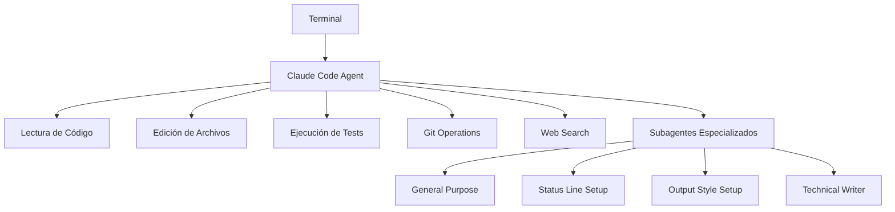
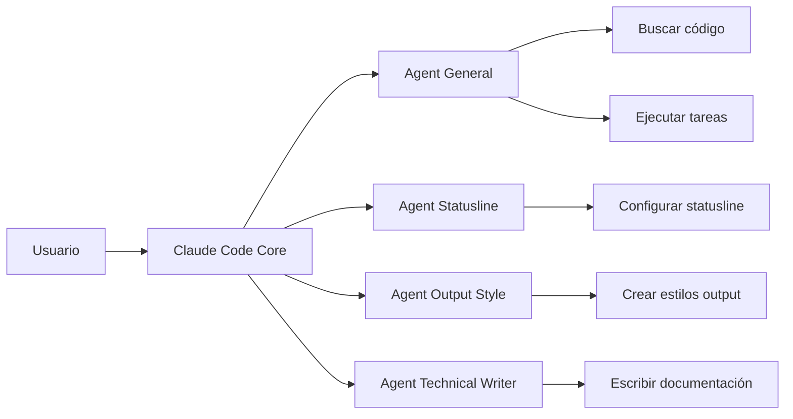
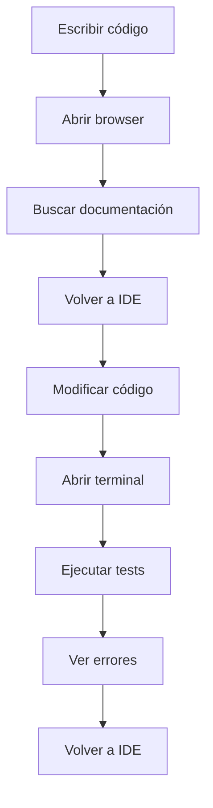
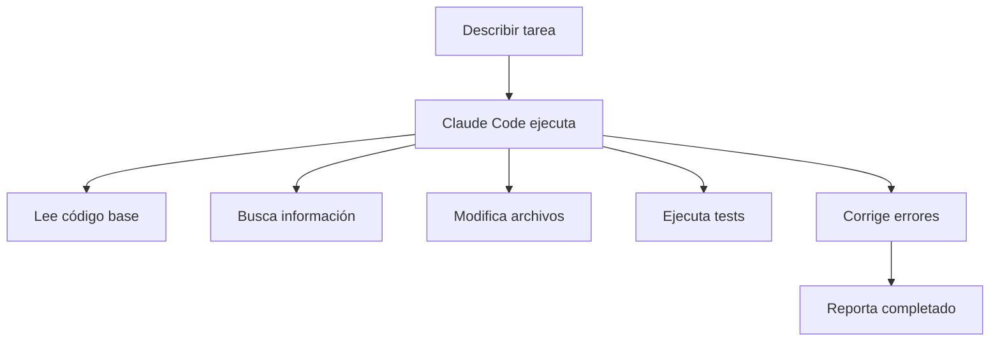
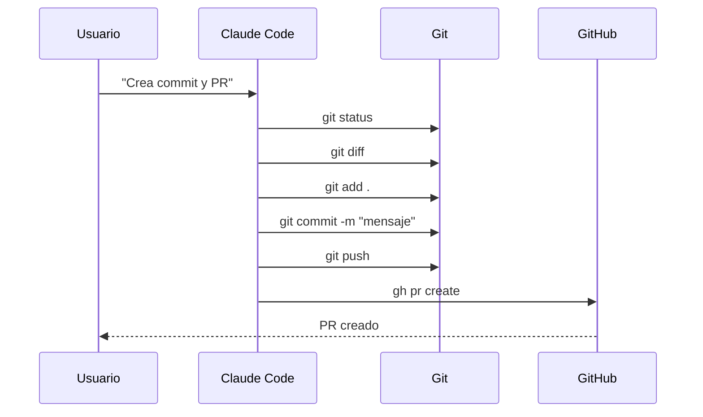
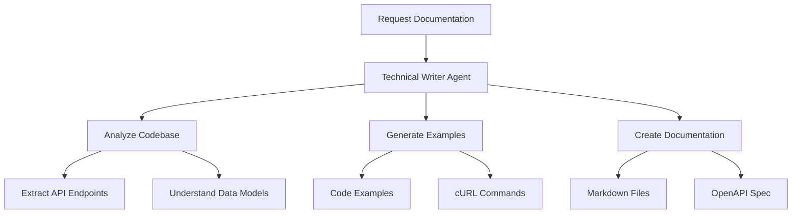
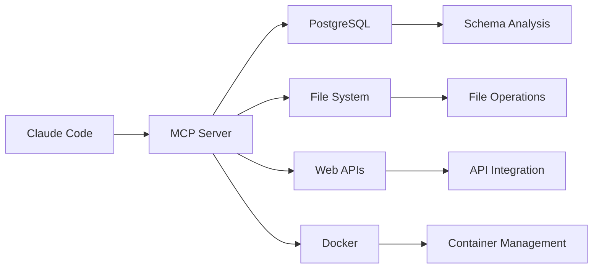
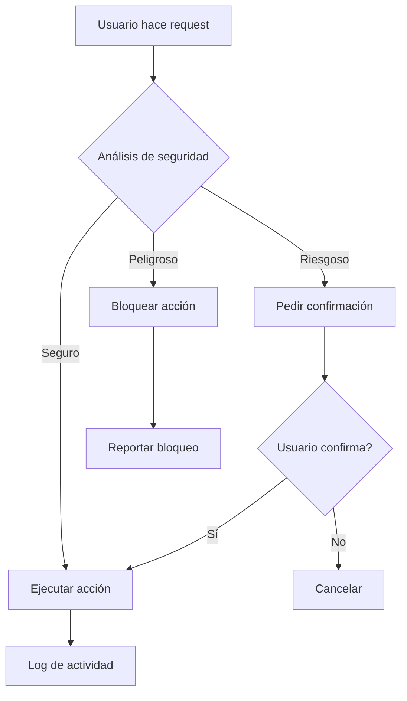

# Guía completa de Claude Code: De la configuración básica al desarrollo avanzado con Agentes de IA

*Por Daniel Ávila, creador de CodeGPT*

Como creador de CodeGPT, he sido testigo de la evolución de los asistentes de IA para programación. Desde los primeros autocompletados hasta los chatbots integrados en IDEs. Pero Claude Code representa algo completamente diferente: **agentes de IA autónomos corriendo directamente en tu terminal**.

## ¿Qué es Claude Code?

Claude Code es un asistente de IA que vive en tu terminal y entiende completamente tu código base. No es solo otro chatbot - es un agente que puede leer, modificar, ejecutar y gestionar proyectos completos de forma autónoma.



## Instalación y Configuración

### Instalación
```bash
npm install -g @anthropic-ai/claude-code
```

### Autenticación
```bash
claude
```
Sigue los prompts para autenticarte con tu cuenta de Anthropic, Claude Pro/Max, Amazon Bedrock o Google Vertex AI.

### Configuración inicial
```bash
claude /config
```

## Arquitectura de Agentes

Claude Code funciona con una arquitectura de agentes especializados:



### Tipos de Agentes Disponibles

- **general-purpose**: Investigación, búsqueda de código, tareas multi-paso
- **statusline-setup**: Configuración de la línea de estado
- **output-style-setup**: Creación de estilos de salida
- **technical-content-writer**: Escritura de contenido técnico accesible

## Comandos Esenciales

### Comandos Slash
```bash
/help          # Ayuda general
/init          # Crear CLAUDE.md para el proyecto
/config        # Configuración de Claude Code
/agents        # Gestionar agentes
/clear         # Limpiar historial
/exit          # Salir
```

### Inicialización de Proyecto
```bash
/init
```
Genera automáticamente un archivo CLAUDE.md con:
- Comandos de build, lint y test
- Arquitectura del código
- Estructura del proyecto

## Flujo de Trabajo Revolucionario

### Antes: Desarrollo Fragmentado


### Ahora: Desarrollo Unificado


## Casos de Uso Avanzados

### 1. Análisis Completo de Código Base
```bash
claude "Analiza este proyecto React y encuentra todos los anti-patrones"
```

Claude Code:
- Lee toda la estructura del proyecto
- Identifica patrones problemáticos
- Sugiere refactorizaciones específicas
- Genera reportes detallados

### 2. Implementación de Features Completas
```bash
claude "Implementa autenticación JWT con refresh tokens, incluyendo middleware, tests y documentación"
```

El agente:
- Crea los archivos necesarios
- Implementa la lógica
- Escribir tests automáticamente
- Actualiza la documentación
- Ejecuta y verifica tests

### 3. Integración con Git
```bash
claude "Revisa mis cambios, crea un commit semántico y abre un PR"
```

Claude Code automáticamente:
- Analiza `git diff`
- Verifica que no haya información sensible
- Crea commit con mensaje descriptivo
- Abre Pull Request con descripción detallada



## SDK y Integración

### Python SDK
```python
from claude_code import ClaudeCode

claude = ClaudeCode()
result = claude.execute_task(
    "Refactoriza esta función para mejorar performance",
    context={"file": "utils.py", "function": "process_data"}
)
```

### TypeScript SDK
```typescript
import { ClaudeCode } from '@anthropic-ai/claude-code-sdk';

const claude = new ClaudeCode();
await claude.executeTask({
  prompt: "Optimiza las consultas de esta API",
  context: { files: ["api/routes.ts", "api/db.ts"] }
});
```

## Subagentes Especializados

### Technical Content Writer
```bash
/agents
claude "Escribe documentación técnica para esta API REST"
```

El agente especializado:
- Analiza endpoints automáticamente
- Genera ejemplos de uso
- Crea documentación en múltiples formatos
- Adapta el lenguaje para diferentes audiencias



## Configuración Avanzada

### Hooks Personalizados
```bash
# .claude/hooks/pre-commit.sh
#!/bin/bash
npm run lint
npm run test
npm run build
```

### Configuración de Modelos
```json
{
  "model": "claude-3-5-sonnet-20241022",
  "temperature": 0.1,
  "max_tokens": 4096
}
```

### MCP (Model Context Protocol)
```bash
claude "Conecta con mi base de datos PostgreSQL y analiza el esquema"
```



## Seguridad y Permisos

Claude Code implementa seguridad granular:



### Control de Acceso
- Permisos por directorio
- Auditoría completa de acciones
- Prevención de exposición de secretos
- Sandboxing de ejecución

## Deployment Empresarial

### Amazon Bedrock
```bash
claude --provider bedrock --region us-east-1
```

### Google Vertex AI
```bash
claude --provider vertex --project your-project-id
```

### Proxy Corporativo
```json
{
  "proxy": {
    "host": "corporate-proxy.com",
    "port": 8080,
    "auth": true
  }
}
```

## Monitoreo y Analytics

```mermaid
dashboard
    title Claude Code Dashboard
    chart bar
        title "Tareas por Tipo"
        x-axis [Code Review, Bug Fix, Documentation, Refactoring]
        y-axis [Cantidad, 0, 100]
        data [75, 45, 30, 60]
    
    chart pie
        title "Tiempo de Desarrollo"
        "Coding Manual" : 40
        "Claude Code" : 60
```

## El Futuro del Desarrollo

Como he visto evolucionar las herramientas de IA, Claude Code representa un punto de inflexión:

1. **De asistente a agente**: No solo sugiere, ejecuta
2. **Contexto completo**: Entiende proyectos enteros, no solo fragmentos
3. **Autonomía real**: Puede completar tareas complejas sin supervisión constante
4. **Integración nativa**: Vive donde trabajas: el terminal

## Primeros Pasos

### 1. Instalación
```bash
npm install -g @anthropic-ai/claude-code
claude
```

### 2. Proyecto de prueba
```bash
mkdir mi-proyecto && cd mi-proyecto
git init
claude /init
claude "Crea una API REST básica con Node.js y Express"
```

### 3. Exploración
```bash
claude "Analiza este código y sugiere mejoras"
claude "Ejecuta los tests y corrige cualquier error"
claude "Genera documentación para esta API"
```

## Conclusión

Los agentes de IA en CLI no son solo una evolución - son una revolución. Hemos pasado de escribir código línea por línea a orquestar agentes inteligentes que entienden, analizan y construyen software de forma autónoma.

Como creador de CodeGPT, puedo afirmar que Claude Code representa el futuro del desarrollo: **colaboración inteligente entre humanos y agentes de IA**, donde los desarrolladores nos enfocamos en la visión y arquitectura, mientras los agentes manejan la implementación y mantenimiento.

La era del desarrollo agentico ha comenzado. ¿Estás listo para ser parte de ella?